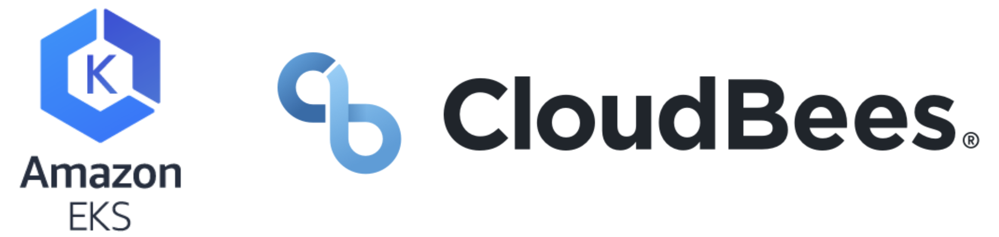

---

title: "Module 1: CloudBees CI Workshop on EKS"
chapter: true
weight: 2
---

# CloudBees CI Workshop on EKS

### Welcome

In this workshop we will learn some best practices around CI/CD that will allow you to rapidly deliver features that will help differentiate your business and reduce time-to-market. 

At your company, Mythical Mysfits, you are launching a new product and your mission is to deliver that product as reliably, quickly and efficiently as you can—while delivering features that set your company apart. Using CloudBees CI, you will configure and manage your own Jenkins server on EKS. This master will build, test and deploy a production-ready application on Amazon EKS. In addition, it will publish, create and push all the infrastructure-as-code requirements for your application to GitHub. This promotes the best practices of DevSecOps combined with GitOps.

### Learning Objectives
- How small, measurable changes drive agility: Build, deploy and test multiple times a day instead of making large complex changes that are difficult to integrate and test
- How to deliver business value rapidly by releasing new features and functionality to customers faster
- How to set up configuration-as-code for your CI/CD tooling (CloudBees CI)
- How to templatize CI/CD pipelines to conform with best practices.  Providing CI/CD as a service for end users
- Ensuring governance and standardization while also empowering developer, security and operations teams by running Jenkins at scale
